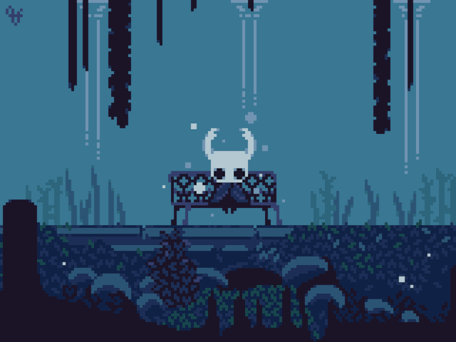

# Hey there ✨

My name is Vinicius, but everyone calls me **Japa :)**

📱 I'm a fullstack student and developer who loves new technologies and challenges that make me think, transform and increase my knowledge

🔮 My favorite programming language is rust.

🌵 In my free time I love to programming and play games

>The real test is not whether you avoid this failure, because you won't. It's whether you let it harden or shame you into inaction, or whether you learn from it; whether you choose to persevere

#### Do you need some help?

  

## My github stats

  

